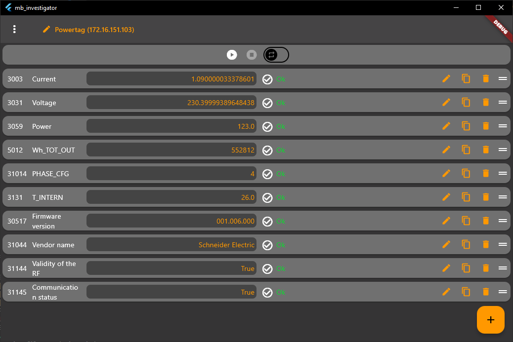

# MB-Investigator
MB-Investigator is tool that act like as a Modbus client/master. It makes it quick and easy to read and write registers on a remote device.

## Download
The software can [**be downloaded here**](https://github.com/Lorin-lab/MB-Investigator/releases).

## Features
- Use TCP, UDP,  Serial RUT of serial ASCII