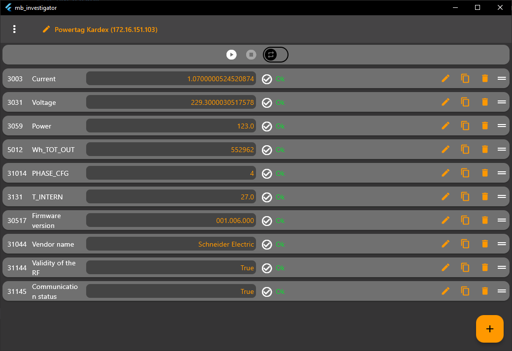

# MB-Investigator
MB-Investigator is tool that act like as a Modbus client/master. It makes it quick and easy to read and write data from registers on a remote device.

## Download
The software can [**be downloaded here**](https://github.com/Lorin-lab/MB-Investigator/releases).

## Features
- Etablish connection using TCP/IP, UDP/IP,  Serial RTU or Serial ASCII.
- Read and write defined variables from a set of registers. 
- Access raw registers or use data representations such as :
    - Signed or unsigned integers
    - Single or double floats, 
    - Booleans 
    - ASCII strings
- Import and export configurations.